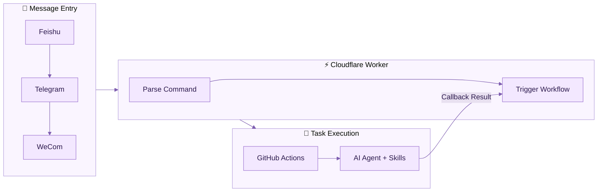
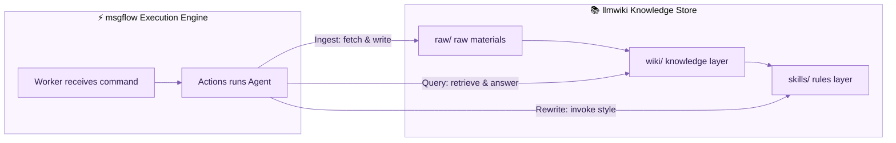

# msgflow

> 💡 Ecosystem Note: This entire project and its 6-layer modular monorepo architecture were fully co-developed, refactored, and optimized natively using AWS Kiro CLI

[中文文档](./README.zh-CN.md)

A message-driven AI content workflow. Send a message via Feishu, Telegram, or WeCom — it automatically handles fetching, rewriting, knowledge management, and publishing. No servers needed, zero-cost operation.

## How It Works



**Core idea**: Chain together free infrastructure so users only pay for AI model API calls.

- **Cloudflare Worker**: Receives messages, parses commands, triggers tasks, returns results (free, 100K requests/day)
- **GitHub Actions**: Provides execution environment for the AI Agent (free for public repos)
- **AI Models**: Called via API, supports any OpenAI-compatible provider

## Supported Commands

| Command | Description |
|---------|-------------|
| Send URL | Fetch webpage as Markdown |
| `ingest <URL>` | Fetch and store in knowledge base |
| `query <question>` | Answer based on knowledge base |
| `rewrite <style> <URL>` | Style rewrite + cover image + publish |
| `distill <person>` | Generate writing style Skill for a person |
| `pending` | List unpublished articles |
| `publish <file>` | Manually publish to Mowen |
| `healthcheck` | Check knowledge base consistency |
| `skill:<name> <message>` | Execute any Skill |

## Quick Start

Two deployment options:

| Method | For | Time |
|--------|-----|------|
| 🤖 [AI-assisted deploy](docs/admin-setup-guide.md) | Users with an AI assistant (Kiro, Claude, ChatGPT, etc.) | ~3 min |
| 🛠️ [Manual deploy](docs/deploy.md) | Hands-on users who want full control | ~15 min |

### AI Deployment (Recommended)

Send this to your AI assistant:

> Deploy msgflow for me. The repo is cloned at `your/path/msgflow`, Worker domain is `your-domain`, ADMIN_TOKEN is `your-password`. Follow docs/admin-setup-guide.md.

The AI will automatically handle KV creation, secret setup, deployment, and verification.

### Manual Deployment (Quick Version)

```bash
cd worker
wrangler login
wrangler kv namespace create MSGFLOW_CONFIG  # Note the id, add to wrangler.toml
wrangler secret put ADMIN_TOKEN              # Admin panel password
wrangler secret put GITHUB_TOKEN             # GitHub PAT
wrangler secret put CALLBACK_SECRET          # Callback verification secret
wrangler secret put TELEGRAM_BOT_TOKEN       # If using Telegram
wrangler deploy
```

After deployment, open the admin panel to configure AI parameters:

```
https://your-domain/admin?token=your-ADMIN_TOKEN
```

> Need help with config values? See the [Configuration Guide](docs/admin-config-guide.md)

Full steps in the [Deployment Guide](docs/deploy.md).

## Project Structure

```
worker/                  # Cloudflare Worker (message receiving + routing)
├── handlers/            # Channel-specific message handlers
├── lib/                 # Shared modules (command parsing, GitHub triggers, config)
└── wrangler.toml.example

tools/                   # Python task executor
├── run_task.py          # CLI entry point
├── capabilities/        # Capability layer (fetching, AI, publishing, covers, storage)
└── pipelines/           # Orchestration layer (fetch, rewrite, ingest, query, etc.)

skills/                  # AI Agent Skills
├── writers/             # Writing styles (Lu Xun, Ma Sanli, Xu Zhimo…)
├── nuwa-skill/          # Distillation workflow
├── llmwiki-agent/       # Knowledge base maintenance
└── markdown-proxy/      # URL fetching

.github/workflows/       # GitHub Actions
└── feishu-task.yml      # Core task execution workflow
```

## Knowledge Base (Optional)

The `ingest`, `query`, and `healthcheck` commands require a companion knowledge base repository.



We recommend using [llmwiki-template](https://github.com/ohwiki/llmwiki-template) as your knowledge base:

**llmwiki-template** is a writing knowledge base template based on the [Karpathy LLM Wiki](https://gist.github.com/karpathy/442a6bf555914893e9891c11519de94f) pattern, providing:

- Three-layer architecture: `raw/` (raw materials) → `wiki/` (knowledge layer) → `skills/` (rules layer)
- Pre-installed writing style Skills (Lu Xun, Ma Sanli, Xu Zhimo)
- Nuwa distillation Skill (input a person's name, auto-generate their thinking style Skill)
- Compatible with all major AI tools (Claude Code, Cursor, Gemini, Kiro, etc.)

**Setup**:

1. Create your own knowledge base repo from llmwiki-template
2. Enter the Wiki Repo and Wiki Token in msgflow's Admin panel
3. Send `ingest <URL>` to automatically fetch articles into the knowledge base

See [llmwiki-template README](https://github.com/ohwiki/llmwiki-template) for details.

## Documentation

| Document | Description |
|----------|-------------|
| [Deployment Guide](docs/deploy.md) | Complete zero-to-deploy tutorial |
| [Telegram Setup](docs/channel-telegram.md) | Telegram Bot creation and configuration |
| [Feishu Setup](docs/channel-feishu.md) | Feishu app creation and event subscription |
| [Feishu Doc Fetching](docs/feishu-doc-fetch.md) | Configure Feishu API for high-quality doc fetching |
| [WeCom Setup](docs/channel-wecom.md) | WeCom custom app configuration |
| [Config Guide](docs/admin-config-guide.md) | How to obtain each config value (beginner-friendly) |
| [Admin Setup](docs/admin-setup-guide.md) | Admin panel deployment steps (with AI-executable version) |
| [Worker Architecture](docs/worker-architecture.md) | Worker modular design and extension plan |
| [Admin Panel Design](docs/admin-panel-design.md) | Admin panel requirements and technical design |

## Costs

| Component | Cost |
|-----------|------|
| Cloudflare Worker | Free (100K requests/day) |
| GitHub Actions | Free (unlimited for public repos) |
| Feishu / Telegram / WeCom | Free |
| AI Model API | Pay per token (free tiers available) |

## Tech Stack

- Cloudflare Worker (JavaScript, no framework)
- GitHub Actions
- Python 3 (task executor)
- [NullClaw](https://github.com/nullclaw/nullclaw) (AI Agent runtime)

## License

MIT
