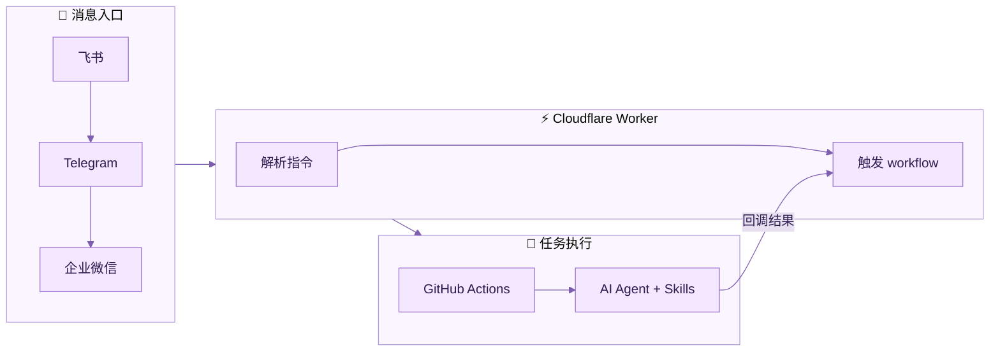
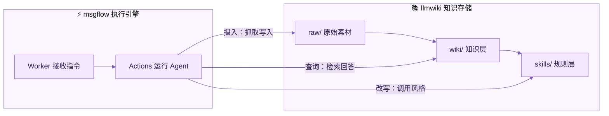

# msgflow

消息驱动的 AI 内容工作流。在飞书、Telegram 或企业微信发一条消息，自动完成抓取、改写、知识管理、发布。无需服务器，零成本运行。

## 工作原理



**核心思路**：用免费基础设施串联整个流程，用户只需要为 AI 模型 API 付费。

- **Cloudflare Worker**：接收消息、解析指令、触发任务、回传结果（免费，10 万次/天）
- **GitHub Actions**：提供运行环境，执行 AI Agent（免费，公开仓库无限制）
- **AI 模型**：通过 API 调用，支持任意 OpenAI 兼容提供商

## 支持的指令

| 指令 | 说明 |
|------|------|
| 发送 URL | 抓取网页为 Markdown |
| `摄入 <URL>` | 抓取并存入知识库 |
| `查询 <问题>` | 基于知识库回答 |
| `改写 鲁迅/马三立/徐志摩 <URL>` | 风格改写 + 封面图 + 发布 |
| `蒸馏 <人名>` | 生成人物写作风格 Skill |
| `待发布` | 列出未上传的文章 |
| `发布 <文件>` | 手动发布到墨问 |
| `健康检查` | 检查知识库一致性 |
| `skill:名称 <消息>` | 执行任意 Skill |

## 快速开始

两种部署方式，选适合你的：

| 方式 | 适合谁 | 时间 |
|------|--------|------|
| 🤖 [让 AI 帮你部署](docs/admin-setup-guide.md#版本二给-ai-助手执行的操作指令) | 有 AI 助手（Kiro、Claude、ChatGPT 等） | ~3 分钟 |
| 🛠️ [手动部署](docs/deploy.md) | 喜欢自己动手，或想了解细节 | ~15 分钟 |

### AI 部署（推荐）

把下面这段话发给你的 AI 助手：

> 帮我部署 msgflow。仓库已克隆到 `你的路径/msgflow`，Worker 域名用 `你的域名`，ADMIN_TOKEN 用 `你想要的密码`。请按照 docs/admin-setup-guide.md 的指令执行。

AI 会自动完成 KV 创建、Secret 设置、部署和验证。

### 手动部署（精简版）

```bash
cd worker
wrangler login
wrangler kv namespace create MSGFLOW_CONFIG  # 记下 id，填入 wrangler.toml
wrangler secret put ADMIN_TOKEN              # 管理页面密码
wrangler secret put GITHUB_TOKEN             # GitHub PAT
wrangler secret put CALLBACK_SECRET          # 回调验证密钥
wrangler secret put TELEGRAM_BOT_TOKEN       # 如需 Telegram
wrangler deploy
```

部署完成后打开管理页面配置 AI 参数：

```
https://你的域名/admin?token=你的ADMIN_TOKEN
```

> 不知道怎么填？查看 [配置项获取指南](docs/admin-config-guide.md)

完整步骤见 [部署指南](docs/deploy.md)。

## 项目结构

```
worker/                  # Cloudflare Worker（消息接收 + 路由）
├── handlers/            # 各渠道消息处理
├── lib/                 # 通用模块（指令解析、GitHub 触发、配置管理）
└── wrangler.toml.example

tools/                   # Python 任务执行器
├── run_task.py          # CLI 入口
├── capabilities/        # 能力层（抓取、AI、发布、封面、存储）
└── pipelines/           # 编排层（fetch、rewrite、ingest、query 等）

skills/                  # AI Agent Skills
├── writers/             # 写作风格（鲁迅、马三立、徐志摩…）
├── nuwa-skill/          # 蒸馏流程
├── llmwiki-agent/       # 知识库维护
└── markdown-proxy/      # URL 抓取

.github/workflows/       # GitHub Actions
└── feishu-task.yml      # 核心任务执行 workflow
```

## 知识库（可选）

msgflow 的 `摄入`、`查询`、`健康检查` 指令需要配合知识库仓库使用。



推荐使用 [llmwiki-template](https://github.com/ohwiki/llmwiki-template) 作为知识库：

**llmwiki-template** 是一个基于 [Karpathy LLM Wiki](https://gist.github.com/karpathy/442a6bf555914893e9891c11519de94f) 模式的写作知识库模板，提供：

- 三层架构：`raw/`（原始素材）→ `wiki/`（知识层）→ `skills/`（规则层）
- 预装写作风格 Skill（鲁迅、马三立、徐志摩）
- 女娲蒸馏 Skill（输入人名，自动生成该人物的思维方式 Skill）
- 兼容所有主流 AI 工具（Claude Code、Cursor、Gemini、Kiro 等）

**设置方法**：

1. 用 llmwiki-template 创建你自己的知识库仓库
2. 在 msgflow Admin 页面填入 Wiki Repo 和 Wiki Token
3. 发送 `摄入 <URL>` 即可自动抓取文章并写入知识库

详见 [llmwiki-template README](https://github.com/ohwiki/llmwiki-template)。

## 文档

| 文档 | 说明 |
|------|------|
| [部署指南](docs/deploy.md) | 完整的从零部署教程 |
| [Telegram 接入](docs/channel-telegram.md) | Telegram Bot 创建和配置 |
| [飞书接入](docs/channel-feishu.md) | 飞书应用创建和事件订阅 |
| [飞书文档抓取](docs/feishu-doc-fetch.md) | 配置飞书 API 高质量抓取文档 |
| [企业微信接入](docs/channel-wecom.md) | 企业微信自建应用配置 |
| [配置项获取指南](docs/admin-config-guide.md) | 每个配置项如何获取（小白友好） |
| [Admin 部署操作](docs/admin-setup-guide.md) | 管理页面部署步骤（含 AI 可执行版） |
| [Worker 架构](docs/worker-architecture.md) | Worker 模块化设计和扩展规划 |
| [Admin 面板设计](docs/admin-panel-design.md) | 管理页面需求和技术设计 |

## 费用

| 组件 | 费用 |
|------|------|
| Cloudflare Worker | 免费（10 万次/天） |
| GitHub Actions | 免费（公开仓库无限制） |
| 飞书 / Telegram / 企业微信 | 免费 |
| AI 模型 API | 按 token 计费（有免费额度） |

## 技术栈

- Cloudflare Worker（JavaScript，无框架）
- GitHub Actions
- Python 3（任务执行器）
- [NullClaw](https://github.com/nullclaw/nullclaw)（AI Agent 运行时）

## License

MIT
