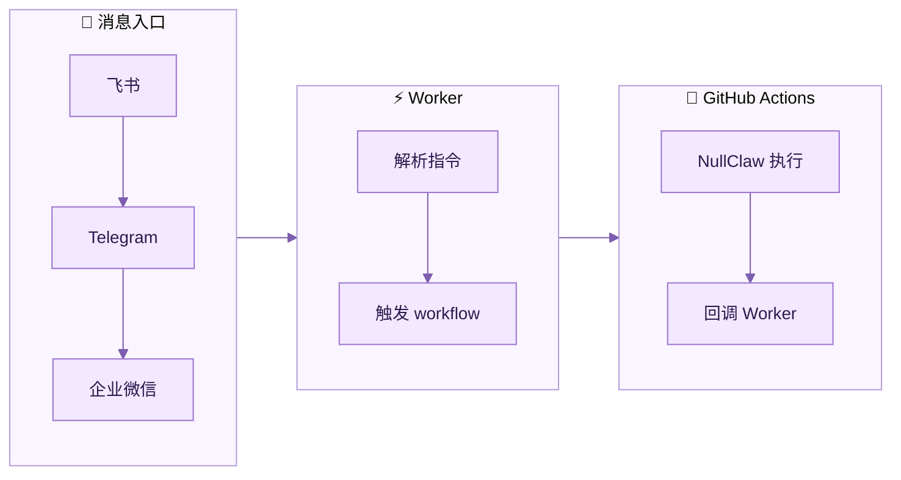
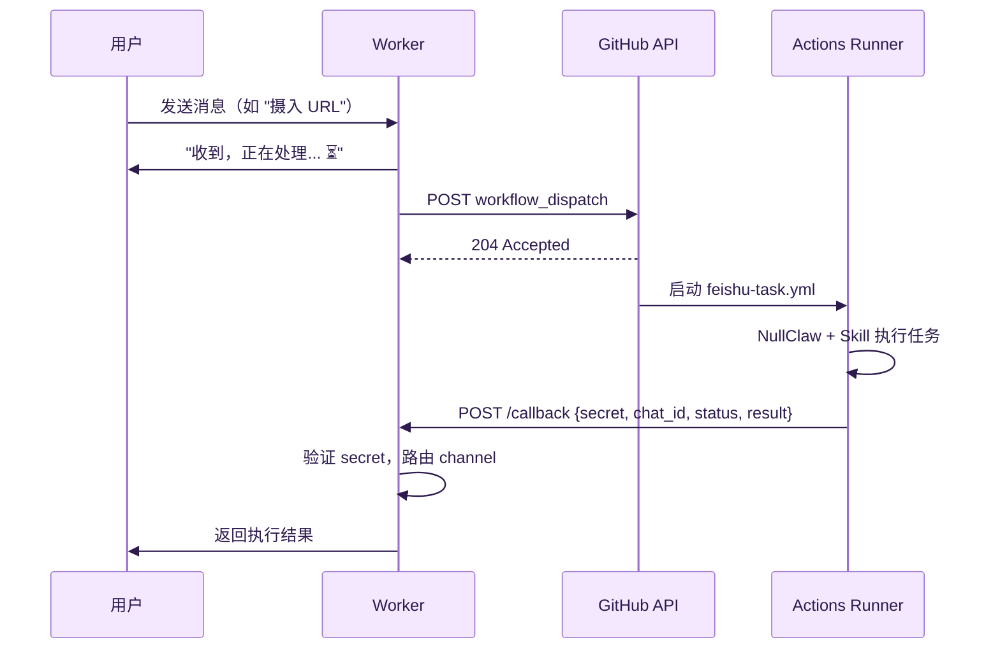
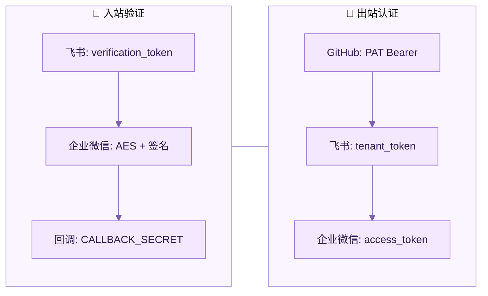

# Worker 与 GitHub Actions 交互流程

## 概览



## 完整时序



## 触发接口（Worker → GitHub）

```
POST https://api.github.com/repos/{GITHUB_REPO}/actions/workflows/feishu-task.yml/dispatches
Authorization: Bearer {GITHUB_TOKEN}

{
  "ref": "main",
  "inputs": {
    "action": "fetch|ingest|query|rewrite|distill|publish|pending|lint|skill",
    "target": "URL 或文本",
    "style": "lu-xun|ma-sanli|xu-zhimo",
    "skill": "skill 名称",
    "chat_id": "telegram:123456",
    "callback_url": "https://your-domain.com/callback"
  }
}
```

GitHub API 返回 204 表示触发成功（异步，不等待执行完成）。

## 回调接口（GitHub → Worker）

```
POST https://your-domain.com/callback
Content-Type: application/json

{
  "secret": "CALLBACK_SECRET（双方共享）",
  "chat_id": "telegram:123456",
  "status": "success|error",
  "result": "执行结果文本"
}
```

Worker 验证 secret 后，根据 `chat_id` 前缀分发到对应 channel。

## chat_id 路由规则

| Channel | 格式 | 示例 |
|---------|------|------|
| Telegram | `telegram:{chat_id}` | `telegram:123456789` |
| 飞书 | `feishu:{chat_id}` | `feishu:oc_abcdef` |
| 企业微信 | `wecom:{userId}\|{agentId}` | `wecom:zhangsan\|1000002` |

## 安全机制



## 设计理由

- **Worker 免费额度大**（10 万次/天），只做消息转发，执行时间 < 1 秒
- **GitHub Actions 免费分钟多**（公开仓库无限），适合跑 AI 推理这种耗时任务
- **解耦**：换 AI 提供商只改 Actions secrets，Worker 不用动
- **可观测**：每次任务在 Actions 有完整日志，比 Worker 的 `wrangler tail` 详细得多
